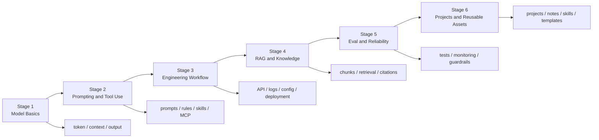
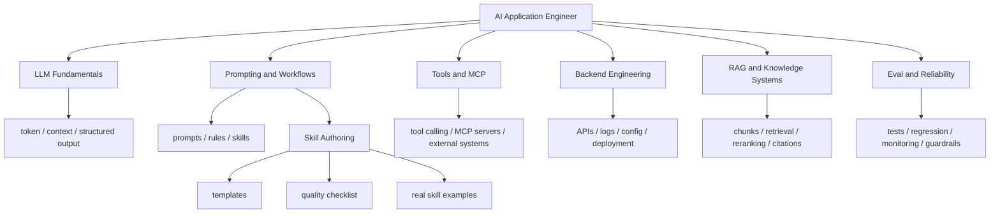

# AI Learning Workspace

> Learn the concepts. Build the workflows. Reuse the patterns.

一个围绕 AI 应用工程学习、方法沉淀和 Codex skills 复用而维护的项目仓库。

## What This Repo Is

这个仓库不是单纯的资料堆，也不是只放学习笔记的目录。

它同时承担 3 个角色：

- 学习路线仓库
- 概念与资料沉淀仓库
- 可复用 Codex skill 示例仓库

如果你想系统理解 `skill`、`prompt`、`rule`、`MCP`、`RAG` 和 AI 应用工程实践之间的关系，这个仓库就是围绕这些主题持续扩展的。

## What This Repo Does

- 把 AI 应用工程学习路径整理成一个可跟踪项目
- 把高频任务沉淀成可复用的 Codex skills
- 把概念、资料、项目记录放在同一仓库里长期维护
- 让“学习”逐步变成“方法库、流程库、作品库”

## Who This Is For

- 想从“会调用模型”走向“会做 AI 应用”的开发者
- 想系统理解 Codex skill 写法和触发方式的人
- 想把学习记录、概念卡片和工作流沉淀成仓库的人
- 想基于中文示例快速上手 AI 应用工程方法的人

## Quick Start

1. 阅读 [roadmap/ai-application-engineer-roadmap.md](roadmap/ai-application-engineer-roadmap.md) 建立整体框架。
2. 阅读 [materials/how-to-write-a-codex-skill.md](materials/how-to-write-a-codex-skill.md) 和配套模板，理解 skill 写法。
3. 查看 [skills/README.md](skills/README.md) 浏览现有 skill 示例。
4. 把后续学习过程持续沉淀到 `notes/`。

## AI 应用开发工程师学习路程

这个仓库后续会持续围绕下面这条学习路径来扩展。目标不是分散学概念，而是按工程能力逐步往前推。

### 阶段 1：先把模型用对

- 理解 token、上下文窗口、结构化输出、模型边界
- 学会调用 API，掌握 prompt 基础和稳定输出
- 区分什么该交给模型，什么该交给代码

### 阶段 2：学会工作流和工具接入

- 理解 `prompt`、`rules`、`skills` 的分工
- 学会 tool calling 和 MCP 的基本接入方式
- 开始把高频任务沉淀成可复用 skill

### 阶段 3：进入工程实现

- 学后端基础：API、日志、配置、部署、鉴权
- 学状态管理、失败兜底、重试、超时
- 把模型调用、工具调用和业务流程接起来

### 阶段 4：补知识系统

- 学 RAG 的切分、检索、重排、引用
- 学会什么时候该用 RAG，什么时候该用 MCP 或直接工具
- 开始做知识问答类 demo 和内部知识场景

### 阶段 5：走向可靠性

- 学测试集、回归测试、评测思路
- 学成本、延迟、成功率、监控和 guardrails
- 让 AI 应用从“能跑”走向“可验证、可维护、可迭代”

### 阶段 6：形成作品和方法库

- 做 2 到 3 个完整项目
- 把项目过程沉淀成 notes、skills、模板和复盘
- 形成自己的 AI 应用工程方法库

## Learning Journey

下面这张图不是概念图，而是整个仓库对应的学习路线图。以后每次补资料、补项目、补 skill，都可以继续挂到这条主线上。



## Learning Map

下面这张图更偏主题结构，用来展示这个项目内部的知识组织方式。



## Learning Roadmap Board

这张表用于持续追踪这个仓库当前处于学习路径的哪个位置，后面可以按阶段持续更新。

| 主题 | 当前状态 | 已有内容 | 下一步 |
| --- | --- | --- | --- |
| Stage 1: 模型基础 | 已建立 | `roadmap/`、基础概念说明 | 持续补 API 和结构化输出案例 |
| Stage 2: Prompt / Skills / MCP | 已建立 | `skills/`、`notes/concepts/` | 继续补 `tool-calling`、更多 workflow 示例 |
| Stage 3: 工程实现 | 初步建立 | 路线与 skill 示例 | 增加真实后端 demo 和项目记录 |
| Stage 4: RAG / 知识系统 | 初步建立 | `notes/concepts/rag.md` | 增加知识问答项目实践 |
| Stage 5: Eval / 可靠性 | 待增强 | 路线中已有位置 | 补 `eval.md`、回归测试和监控实践 |
| Stage 6: 项目作品库 | 待增强 | `notes/projects/` 模板 | 增加 2 到 3 个完整项目案例 |

## Common Workflows

### 1. 学一个新概念

1. 先把资料登记到 `materials/resource-index.md`
2. 看完后沉淀到 `notes/concepts/`
3. 如果形成了稳定方法，再考虑写成 skill

### 2. 写一个新 skill

1. 先看 `materials/how-to-write-a-codex-skill.md`
2. 再看 `materials/skill-template.md`
3. 用 `materials/skill-quality-checklist.md` 自检
4. 最后把重要 skill 补到 `skills/README.md`

### 3. 做一个项目练习

1. 用 `roadmap/` 选一个阶段目标
2. 在 `notes/projects/` 里记录设计、问题和取舍
3. 如有稳定流程，再反向沉淀成 skill 或概念卡片

## Repo Structure

```text
ai-learning/
├── roadmap/      # 学习路线和阶段目标
├── materials/    # 模板、资料索引、判断指南
├── notes/        # 概念、日常学习记录、项目实践
├── skills/       # Codex skills 示例
└── docs/         # 额外专题文档
```

## Repository Highlights

- 一份从基础到工程化的 [学习路线](roadmap/ai-application-engineer-roadmap.md)
- 一组可直接参考的 [Codex skills](skills/README.md)
- 一套围绕 skill 编写的模板、检查表和判断指南，位于 `materials/`
- 一组概念笔记，帮助区分 `skills`、`rules`、`MCP`、`prompts`、`RAG`

## Skills Included

当前仓库内已经包含这些可直接参考的示例：

- `query-openai-docs`
- `organize-ai-learning-notes`
- `generate-study-plan`
- `daily-learning-review`
- `ai-material-organizer`
- `implement-feature-with-tests`
- `bug-triage`
- `codebase-review`
- `refactor-with-safety`
- `summarize-task-changes`

## Recommended Reading Order

1. 先看学习路线，建立整体框架
2. 再看 `materials/` 里的 skill 写作模板和检查表
3. 接着浏览 `skills/` 中的具体示例
4. 最后把自己的理解继续沉淀到 `notes/` 中

## Maintenance Principles

- 记录自己的理解，不要只摘抄资料
- 每条笔记尽量回答“是什么、为什么、怎么用”
- 项目记录优先写真实问题和真实取舍
- skill 保持轻量，流程放 `SKILL.md`，细节按需放到 `references/`
- 每周至少做一次阶段复盘

## Contributing

欢迎补充：

- 新的中文 skill 示例
- 更清晰的概念解释
- 更实用的学习资料索引
- 项目实践记录和复盘模板

详细说明见 [CONTRIBUTING.md](CONTRIBUTING.md)。

## License

本仓库使用 [MIT License](LICENSE)。
